# Паттерны

Реализация паттернов на Python, описанных "бандой четырёх" из книги "Head First Design Patterns". Своебразная шпора по проектированию с примерами и иллюстрациями.

Картинки позаимствованы отсюда: http://www.mcdonaldland.info/2007/11/28/40/  
Определения цитируют Head First. Паттерны проектирования. Обновленное юбилейное издание. — СПб.: Питер, 2018.

## Strategy/Стратегия
Определяет семейство алгоритмов, инкапсулирует каждый из них и обеспечивает их взаимозаменяемость. Он позволяет модифицировать алгоритмы независимо от их использования на стороне клиента.

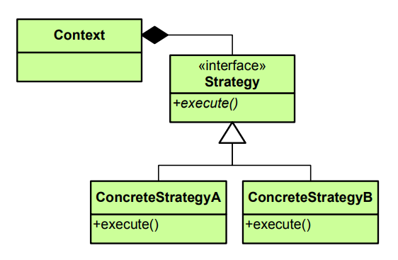

## Observer/Наблюдатель
Наблюдатель — определяет отношение «один-комногим» между объектами таким образом, что при изменении состояния одного объекта происходит автоматическое оповещение и обновление

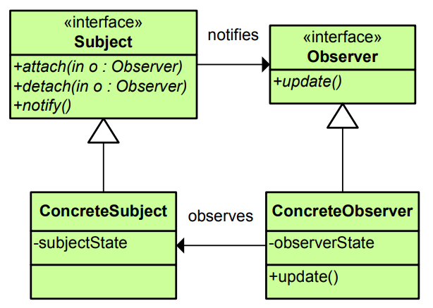

## Decorator/Декоратор
Динамически наделяет объект новыми возможностями и является гибкой альтернативой субклассированию в области расширения функциональности.

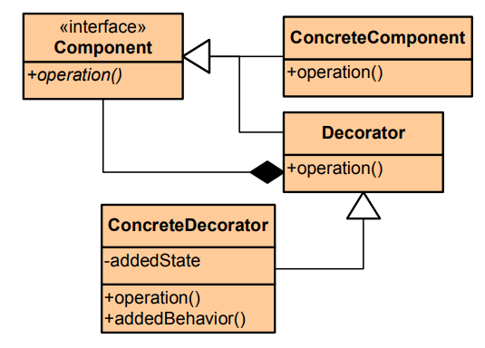

## Fabric Method/Фабричный метод
Определяет интерфейс создания объекта, но позволяет субклассам выбрать класс создаваемого экземпляра. Таким образом, Фабричный Метод делегирует операцию создания экземпляра субклассам.

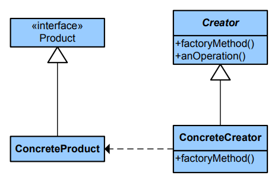

## Abstract Factory/Абстрактная фабрика
Предоставляет интерфейс создания семейств взаимосвязанных или взаимозависимых объектов без указания их конкретных классов.

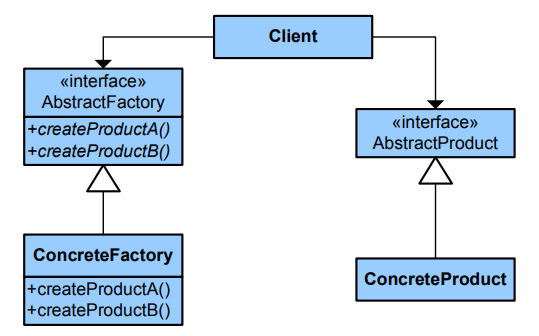

## Singleton/Одиночка
Гарантирует, что класс имеет только один экземпляр, и предоставляет глобальную точку доступа к этому экземпляру.

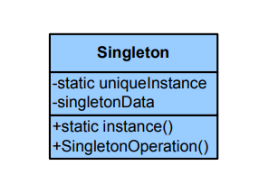

## Command/Команда
Инкапсулирует запрос в виде объекта, делая возможной параметризацию клиентских объектов с другими запросами, организацию очереди или регистрацию запросов, а также поддержку отмены операций.

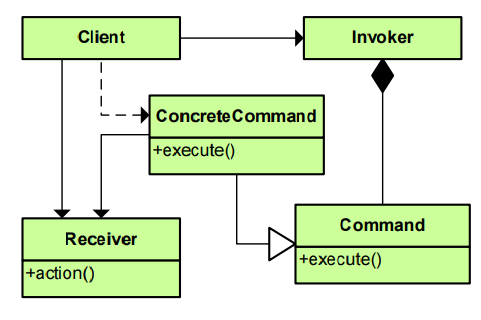

## Adapter/Адаптер
Преобразует интерфейс класса к другому интерфейсу, на который рассчитан клиент. Адаптер обеспечивает совместную работу классов, невозможную в обычных условиях из-за несовместимости интерфейсов.

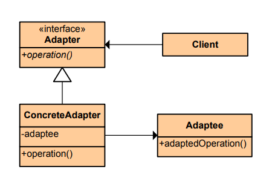

## Facade/Фасад
Предоставляет унифицированный интерфейс к группе интерфейсов подсистемы. Фасад определяет высокоуровневый интерфейс, упрощающий работу с подсистемой.

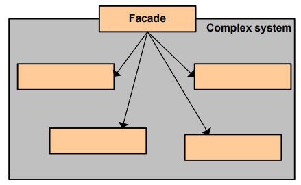

## Template Method/Шаблонный Метод
Определяет «скелет» алгоритма в методе, оставляя определение реализации некоторых шагов субклассам. Субклассы могут переопределять  некоторые части алгоритма без изменения его структуры.

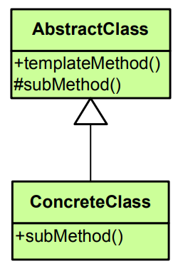

## Iterator/Итератор
Предоставляет механизм последовательного перебора элементов коллекции без раскрытия ее внутреннего представления.

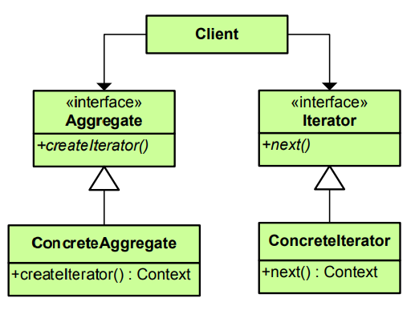
